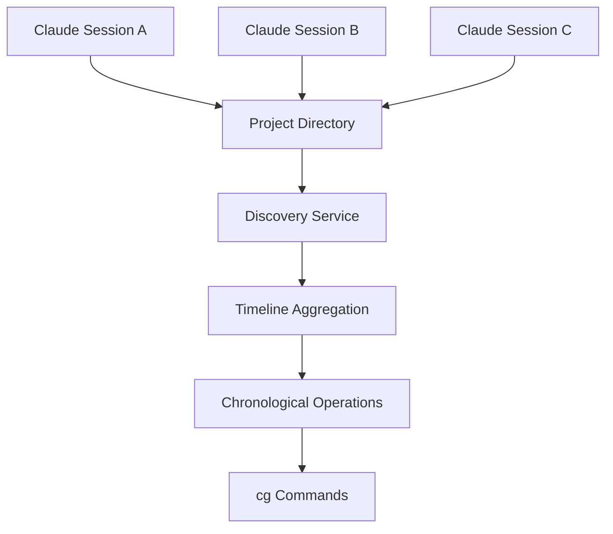

# Claude Parser 🎯

> **Git-like interface for navigating Claude Code conversations and file operations**

Transform your Claude Code workflow with intelligent multi-session navigation, UUID-based file restoration, and git-style commands.

## ✨ Features

- **🔀 Multi-Session Support**: Track operations across concurrent Claude Code sessions
- **⚡ Git-Like Interface**: Familiar `cg` commands for navigation and undo operations
- **🎯 Auto-Detection**: Automatically finds your Claude Code projects
- **📝 UUID Navigation**: Jump to any specific operation state
- **🔄 File Restoration**: Restore files to exact state at any point
- **📊 Session Intelligence**: View which sessions modified which files

## 🚀 Quick Start

### System Requirements
- **Supported**: macOS, Linux (Unix-like systems)
- **Requirements**: Claude Code installed with active projects
- **Python**: 3.9+ with pip

### Installation

```bash
pip install claude-parser
```

### Verify Setup

```bash
# Check if Claude Code projects exist
ls ~/.claude/projects
# Should show directories like: -Volumes-Dev-my-project

# Test the cg command
cg status
# Should show your current project status
```

## 🎮 Commands

### Core Navigation
```bash
cg status              # Show current project and session info
cg log                 # View operation history across all sessions
cg log --file app.py   # Show history for specific file
cg checkout <uuid>     # Restore to specific operation state
```

### Undo & Time Travel
```bash
cg undo 3              # Go back 3 operations (any file, any session)
cg undo --to <uuid>    # Go back to specific UUID
cg reset <uuid>        # Reset to operation (like git reset)
```

### Multi-Session Intelligence
```bash
cg status --sessions   # Show all sessions working on this project
cg log --sessions      # History with session information
cg diff <uuid1>..<uuid2>  # Compare states across sessions
```

### Information & Analysis
```bash
cg show <uuid>         # Detailed view of specific operation
cg diff                # Show recent changes
cg branch              # List available branches
```

## 🔄 Real-World Workflow

### Scenario: Multi-Session File Conflicts

```bash
# You're working on app.py, Claude session A modifies it
# Meanwhile, Claude session B also modifies app.py
# Now you want to see what happened:

cg status --sessions
# 📊 Multi-Session Summary
#    Sessions: 2
#    Operations: 8
#    🔀 Session abc12345: 4 ops → app.py, config.py
#    🔀 Session def67890: 4 ops → app.py, utils.py

# View the timeline for app.py across both sessions
cg log --file app.py
# 📅 Timeline for app.py (6 operations)
#    1. a1b2c3d4 (Write) [abc12345] 2025-01-04T10:15:30
#    2. e5f6g7h8 (Edit) [abc12345] 2025-01-04T10:16:45
#    3. i9j0k1l2 (Edit) [def67890] 2025-01-04T10:17:20
#    ...

# Go back to before the conflict
cg undo 3
# ✅ Undid 3 changes. Restored app.py to state before conflicts

# Or jump to specific operation
cg checkout e5f6g7h8
# ✅ Restored to UUID e5f6g7h8 - Edit app.py (Session: abc12345)
```

### Scenario: "What Changed Recently?"

```bash
# After a complex Claude session, see what happened
cg status
# 📊 Timeline Summary (12 operations from 1 session)
# 📂 Project: /Users/dev/my-app
#   📄 app.py: 5 operations
#   📄 config.py: 3 operations
#   📄 utils.py: 4 operations

# See recent changes
cg log --oneline
# a1b2c3d4 Write app.py
# e5f6g7h8 Edit config.py
# i9j0k1l2 MultiEdit utils.py
# ...

# Undo the last 2 operations across all files
cg undo 2
# ✅ Undid 2 changes across app.py and utils.py
```

## 🏗️ Architecture

Claude Parser leverages your existing Claude Code setup:

```
~/.claude/projects/     ← Your Claude Code transcripts
       ↓
   Discovery Service    ← Finds all sessions for project
       ↓
   RealClaudeTimeline  ← Processes JSONL into git-like commits
       ↓
   Navigation Service   ← UUID-based state restoration
       ↓
   cg Commands         ← Git-like CLI interface
```

### Multi-Session Intelligence



## 📚 Advanced Usage

### Branch Operations
```bash
# List branches (from git repository in timeline)
cg branch
# * main
#   feature-branch
#   session-experiment

# Create branch at current operation
cg branch new-feature

# Switch branches
cg checkout feature-branch
```

### Detailed Analysis
```bash
# Compare two specific operations
cg diff abc12345..def67890
# Shows exact file changes between UUIDs

# Show what specific operation did
cg show abc12345
# 🔍 Operation abc12345
#    Type: Edit
#    File: app.py
#    Session: abc12345
#    Changes: +5 lines, -2 lines

# Export operation history
cg log --format=json > operations.json
```

## 🔧 Configuration

### Project Detection
Claude Parser automatically detects your current project by:
1. Looking for `~/.claude/projects/` directory matching current path
2. Using current working directory for project identification
3. Aggregating all JSONL files for that project

### Custom Paths
```bash
# Work with specific project
cg --project /path/to/project status

# Use different Claude directory (if non-standard setup)
cg --claude-dir /custom/claude/path status
```

## 🧪 Testing Your Setup

```bash
# Verify Claude Code integration
ls ~/.claude/projects
# Should show encoded project directories

# Test with actual Claude-generated data
cd /your/project
cg status
# Should show operations from your Claude Code sessions

# Test multi-session detection
cg log --sessions
# Should show all Claude sessions that worked on this project
```

## 🚧 Platform Support

### Currently Supported
- ✅ **macOS**: Full support with `~/.claude/projects`
- ✅ **Linux**: Full support with `~/.claude/projects`

### Coming Soon
- ⏳ **Windows**: Support for Windows Claude Code paths
- ⏳ **Custom paths**: Configurable Claude directory locations

## 🐛 Troubleshooting

### "No Claude Code sessions found"
```bash
# Check Claude directory exists
ls ~/.claude/projects
# If empty or missing, run Claude Code first to generate projects

# Check current directory is a Claude project
pwd
# Make sure you're in a directory that Claude Code has worked on
```

### "Cannot restore to UUID"
```bash
# Verify UUID exists
cg log | grep <uuid>
# UUID should appear in operation history

# Check UUID format
cg log --format=full
# Copy exact UUID from output
```

### Multi-Session Issues
```bash
# Check all sessions detected
cg status --sessions
# Should show multiple sessions if you've had concurrent Claude work

# Verify session isolation
cg log --sessions
# Each operation should show session ID in brackets [abc12345]
```

## 🤝 Contributing

Claude Parser follows the 95/5 principle: 95% library code, 5% glue code.

### Development Setup
```bash
git clone https://github.com/your-org/claude-parser
cd claude-parser
pip install -e ".[dev]"
pytest tests/
```

### Testing with Real Data
```bash
# Test against your actual Claude Code projects
cd /your/claude/project
python -m claude_parser.cli status --sessions

# Run integration tests
pytest tests/test_real_claude_timeline.py -v
```

## 📖 Documentation

- [Command Reference](docs/cg-command-reference.md) - Complete `cg` command guide
- [Multi-Session Guide](docs/multi-session-guide.md) - Handling concurrent Claude sessions
- [Architecture](docs/architecture.md) - Technical implementation details
- [API Reference](docs/api-reference.md) - Python API usage

## 📄 License

MIT License - see LICENSE file for details.

## 🏆 Credits

Built with the 95/5 principle using:
- **GitPython** - Git repository operations
- **typer** - CLI framework
- **rich** - Terminal output formatting
- **pathlib** - Cross-platform path handling
- **orjson** - Fast JSON processing
